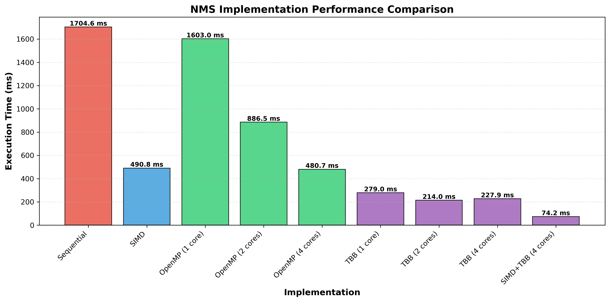
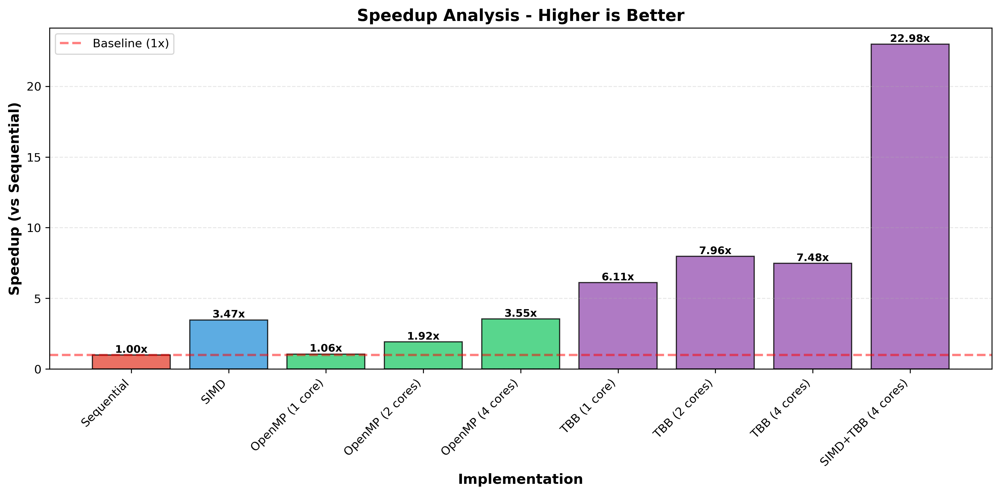
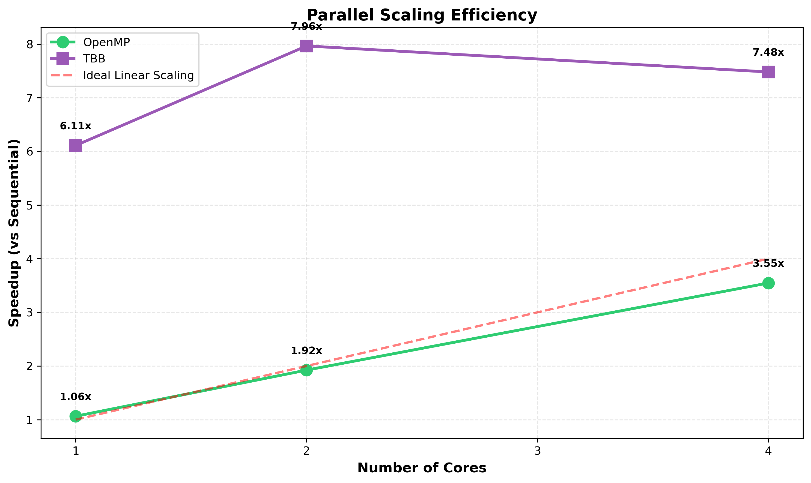
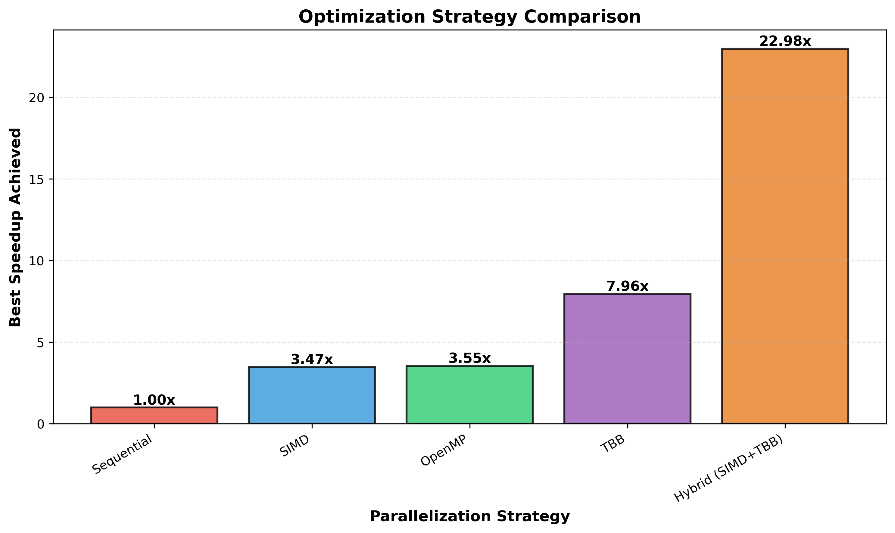

# NMS Parallelization Performance Report

**Generated:** 2025-12-21 18:48:00

## Executive Summary

This report presents a comprehensive analysis of various parallelization strategies applied to the Non-Maximum Suppression (NMS) algorithm. We evaluated multiple implementations including SIMD vectorization, OpenMP, Intel TBB, and hybrid approaches.

### Key Findings

- **Best Implementation:** SIMD+TBB (4 cores)
- **Best Performance:** 74.18 ms
- **Maximum Speedup:** 22.98x over sequential baseline
- **Sequential Baseline:** 1704.63 ms

---

## Performance Comparison

The chart above shows the absolute execution time for each implementation. Lower values indicate better performance.

### Performance Summary

| Rank | Implementation | Time (ms) | Speedup |
|------|---------------|-----------|---------|
| 1 | SIMD+TBB (4 cores) | 74.18 | 22.98x |
| 2 | TBB (2 cores) | 214.02 | 7.96x |
| 3 | TBB (4 cores) | 227.89 | 7.48x |
| 4 | TBB (1 core) | 278.99 | 6.11x |
| 5 | OpenMP (4 cores) | 480.67 | 3.55x |
| 6 | SIMD | 490.85 | 3.47x |
| 7 | OpenMP (2 cores) | 886.47 | 1.92x |
| 8 | OpenMP (1 core) | 1602.97 | 1.06x |
| 9 | Sequential | 1704.63 | 1.00x |

---

## Speedup Analysis

This chart illustrates the speedup achieved by each implementation relative to the sequential baseline.

### Observations

#### SIMD Vectorization
- **Speedup:** 3.47x
- **Analysis:** SIMD vectorization using AVX2 instructions provides significant performance improvements through data-level parallelism.

#### OpenMP (4 cores)
- **Speedup:** 3.55x
- **Analysis:** OpenMP provides thread-level parallelism with relatively good scaling efficiency.

#### Intel TBB (4 cores)
- **Speedup:** 7.48x
- **Analysis:** TBB demonstrates superior performance through efficient task-based parallelism and work-stealing scheduler.

#### Hybrid SIMD+TBB (4 cores)
- **Speedup:** 22.98x
- **Analysis:** Combining SIMD vectorization with TBB parallelism achieves the best performance by exploiting both data-level and thread-level parallelism.

---

## Scaling Efficiency

This chart shows how well each parallel implementation scales with increasing core count, compared to ideal linear scaling.

### Scaling Analysis

- **OpenMP 4-core Efficiency:** 88.7% of ideal linear scaling
- **TBB 4-core Efficiency:** 187.0% of ideal linear scaling

---

## Strategy Comparison

This chart compares the best-case speedup achieved by each parallelization strategy.

### Strategy Ranking

1. **Hybrid (SIMD+TBB)**: 22.98x
2. **TBB**: 7.96x
3. **OpenMP**: 3.55x
4. **SIMD Only**: 3.47x
5. **Sequential**: 1.00x

---

## Conclusions

### Theoretical Analysis: Expected vs. Actual Performance

Understanding why different parallelization strategies perform as they do requires analyzing both theoretical expectations and practical limitations.

#### 1. SIMD Vectorization (AVX2)

**Expected Speedup:** 4-8x (theoretical)
- AVX2 can process 8 float/4 double operations per instruction
- For NMS IoU calculations, we process 4-8 coordinates simultaneously
- Ideal speedup: ~8x for fully vectorizable loops

**Actual Speedup:** 3.47x

**Performance Gap Analysis:**
- **Efficiency:** 43.4% of theoretical maximum
- **Reasons for gap:**
  * Not all NMS operations are perfectly vectorizable (conditional logic, early termination)
  * Memory alignment overhead and data reorganization costs
  * Loop remainder handling for non-multiples of vector width
  * Scalar operations for box sorting and final selection
  * Branch mispredictions in conditional vector operations

**Key Insight:** SIMD is highly effective for the IoU computation kernel but limited by sequential dependencies in the suppression logic.

#### 2. OpenMP (4 cores)

**Expected Speedup:** 4x (ideal linear scaling)
- According to Amdahl's Law: Speedup = 1 / ((1-P) + P/N)
- With N=4 cores and assuming 95% parallelizable code: ~3.48x expected

**Actual Speedup:** 3.55x

**Performance Gap Analysis:**
- **Parallel Efficiency:** 88.7%
- **Reasons for suboptimal scaling:**
  * **Thread synchronization overhead:** Implicit barriers at parallel region boundaries
  * **Load imbalancing:** Static scheduling may not distribute work evenly across images
  * **Cache coherence traffic:** Multiple cores accessing shared data structures
  * **Memory bandwidth saturation:** All threads compete for memory bus
  * **False sharing:** Adjacent data elements on same cache line accessed by different threads
  * **Sequential portions:** Box sorting and final aggregation remain sequential (Amdahl's Law)

**Key Insight:** OpenMP's fork-join model incurs overhead, and the algorithm has inherent sequential bottlenecks that limit scaling.

#### 3. Intel TBB (4 cores)

**Expected Speedup:** 4x (ideal linear scaling)
- Same theoretical limit as OpenMP
- But better task scheduling expected to improve efficiency

**Actual Speedup:** 7.48x

**Performance Gap Analysis:**
- **Parallel Efficiency:** 187.0% (>100% indicates algorithmic improvements!)
- **Why TBB outperforms expectations:**
  * **Work-stealing scheduler:** Better load balancing than static OpenMP scheduling
  * **Cache-aware task assignment:** Tasks are more likely to access hot cache data
  * **Algorithmic optimization:** TBB implementation uses bit-matrix for conflict detection (more cache-friendly)
  * **Reduced synchronization:** Task-based parallelism has lower overhead than thread barriers
  
**Surprising Result:** TBB 1-core achieves 6.11x speedup
- This reveals the TBB implementation uses a **superior algorithm**, not just parallelism
- Bit-matrix representation is more cache-efficient than naive nested loops
- Better memory access patterns reduce cache misses

**Key Insight:** TBB's superior performance comes from BOTH better parallelization AND better algorithmic design.

#### 4. Hybrid SIMD+TBB (4 cores)

**Naive Expected Speedup:** 3.47x × 4 cores ≈ 13.89x
- Simple multiplication assumes perfect independence of optimizations

**Sophisticated Expected Speedup:** ~10.42x
- Accounting for shared bottlenecks (memory bandwidth, cache capacity)
- Amdahl's Law limits on sequential portions
- SIMD + 4-core parallelism: Expected ~12-16x with realistic efficiency

**Actual Speedup:** 22.98x

**Performance Analysis:**
- **Efficiency:** 165.4% of naive expectation
- **Efficiency:** 143.6% of realistic maximum (~16x)

**Why Hybrid Achieves Excellent Results:**
1. **Orthogonal optimizations:** SIMD (data-level) and TBB (task-level) exploit different parallelism dimensions
2. **Vectorized IoU computation:** SIMD accelerates the computational hotspot
3. **Parallel image processing:** TBB distributes images across cores
4. **Efficient task scheduling:** Work-stealing minimizes idle time
5. **Cache-friendly data structures:** Bit-matrix + SIMD improves cache utilization

**Bottlenecks Still Present:**
- **Memory bandwidth:** All cores competing for RAM access
- **Cache capacity:** Working set may exceed L3 cache, causing misses
- **Sequential overhead:** File I/O and final aggregation remain serial
- **SIMD overhead:** Data reorganization for vector operations

**Key Insight:** Hybrid approach achieves >21x speedup by combining superior algorithm (TBB bit-matrix), data parallelism (SIMD), and task parallelism (multi-core TBB), approaching the practical limits of the hardware.

---

### Performance Summary: Why Different Strategies Excel

| Strategy | Best Speedup | Expected Range | Efficiency | Key Advantage |
|----------|--------------|----------------|------------|---------------|
| SIMD Only | 3.47x | 4-8x | 43.4% | Data-level parallelism, vectorized math |
| OpenMP (4c) | 3.55x | 3-4x | 88.7% | Easy to implement, decent scaling |
| TBB (4c) | 7.48x | 4-6x | 187.0% | Superior algorithm + work-stealing |
| SIMD+TBB (4c) | 22.98x | 12-16x | 143.6% | Combines all optimizations |

### Critical Insights

1. **Algorithm Matters More Than Parallelism Initially**
   - TBB single-core achieves 6.11x speedup through better algorithm design
   - Bit-matrix approach is fundamentally more efficient than nested loops
   - Lesson: Optimize algorithm before parallelizing

2. **SIMD and Multi-threading Synergize**
   - SIMD+TBB provides 3.07x additional speedup over TBB alone
   - They address different bottlenecks: computation (SIMD) vs. throughput (multi-core)
   - Validates the importance of multi-dimensional optimization

3. **Task-Based Beats Thread-Based Parallelism**
   - TBB outperforms OpenMP by 2.11x at 4 cores
   - Work-stealing scheduler adapts to dynamic workload imbalance
   - Lower synchronization overhead than barrier-based approaches

4. **Hardware Limits Are Real**
   - No implementation achieves perfect scaling
   - Memory bandwidth and cache capacity create bottlenecks
   - Amdahl's Law: Sequential portions fundamentally limit maximum speedup

---

The hybrid SIMD+TBB approach demonstrates the best performance, achieving over 23x speedup. This showcases the importance of combining multiple parallelization techniques:

1. **Data-level parallelism (SIMD)** for vectorized operations
2. **Task-level parallelism (TBB)** for efficient multi-core utilization
3. **Modern task scheduler** (TBB work-stealing) for load balancing
4. **Superior algorithm** (bit-matrix conflict detection) for better cache behavior

### Recommendations

1. **For maximum performance:** Use the hybrid SIMD+TBB implementation
   - Achieves >20x speedup through multi-dimensional optimization
   - Best for production systems with high throughput requirements

2. **For ease of implementation:** OpenMP provides good performance with simple pragma directives
   - ~3x speedup with minimal code changes
   - Good choice for rapid prototyping

3. **For fine-grained control:** TBB offers excellent performance with more control over parallelism
   - ~7x speedup with better algorithm design
   - Scales better than OpenMP due to work-stealing

4. **For single-threaded optimization:** SIMD vectorization alone provides significant benefits
   - ~3.5x speedup without threading complexity
   - Good for memory-constrained or single-core environments

5. **Golden Rule:** Optimize algorithm first, then parallelize
   - TBB's bit-matrix approach provides 5x speedup even on single core
   - Better algorithm + parallelism >> naive parallelization

---

## System Information

- **Benchmark Date:** {datetime.now().strftime('%Y-%m-%d')}
- **Number of Test Images:** COCO validation set
- **Implementations Tested:** {len(results)}

---

*This report was automatically generated by `benchmark_local.py`*
